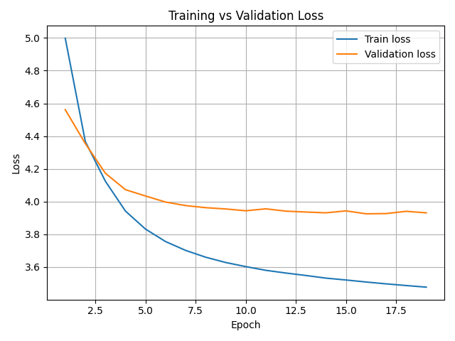

## What is this repository about?

This repository constitutes the final assigment for the course "Buildung GPT from scratch" taught by Prof. Elia Bruni and was submitted by Jonah Schlie, William Shelor, Zeynep Koçak and Yash Saraswat. 

During the course we investigated step by step how GPTs are build inclusive preprocessing, preceding language models before the modern Transformer Achitecture came up, and finally the transformer based mini GPT. The course and therefore the repo as well are structured in 4 milestones which were implemented by us. 
1. Byte Pair Encoder
2. Classical N-Gram
3. Neural N-Gram
4. GPT

## Repository Structure

The repository is mainly structured along the 4 mentioned milestones as you can see below:

```markdown
mini-gpt/
├── data/              # shakespeare text data and modern corpus
├── weights/           # the weights of the trained gpt model
├── unix/              # contains a notebook for unix and python based tokenization
├── bpe/               # Code for BPE (Milestone 1)
├── models/            # bpe models and classical ngram models
├── classical_ngram/   # Classical N-Gram Model implementation (milestone 2)
├── neural_ngram/      # Classical and Neural N-Gram Model implementation (milestone 3)
├── gpt /              # The GPT implementation (milestone 4)
├── utils/             # Functions that are used across all milestones  
├── requirements.txt/  # list of needed python packages to run the code 
├── main.py            # The whole GPT pipeline + test generation
└── README.md          # Technical Report
```
Each milestone folder contains the model implementation, a utils folder with general-purpose functions (kept separate from the model class for best practices), and a main script used for testing, optimization, and experimentation (details provided later).

## Getting Started

##### Installation  
```bash  
git clone https://github.com/your-username/mini-gpt.git
cd mini-gpt
pip install -r requirements.txt
```

##### Running
To run the main GPT script just use the following command in the repos root directory:
```bash
python -m main
```

To run the main script of each milestone independently use the following command in the repos root directory:
```bash
python -m bpe.main
python -m classical_ngram.main
python -m neural_ngram.main
python -m gpt.main
```
What the actual scripts are about will be described detailed in the following technical report.

## Technical Report

### Unix Command
In the lecture, we were introduced to a Unix one-liner that lowercases the Shakespeare text, tokenizes it into words, and produces a frequency list:
```bash
tr 'A-Z' 'a-z' < '../data/shakespeare/Shakespeare_clean_full.txt' | tr -sc 'A-Za-z' '\n' | sort | uniq -c | sort -n -r
```
This commmand:

1. Converts all text to lowercase
2. Splits on any non-alphabetic characters to extract words.
3. Sorts and counts word occurrences.
4. Displays the most frequent word first.

To replicate this pipeline in Python, I used NLTK’s regexp_tokenize, which allows custom regular expressions for 
tokenization. I defined a regex pattern that captures alphabetic words `(\b[A-Za-z]+\b)` and selected punctuation symbols.
After tokenizing the Shakespeare corpus into lowercase tokens, I counted their frequencies with a simple dictionary and
sorted the results in descending order.

This approach mirrors the Unix command but is implemented entirely in Python, making it easier to integrate into the rest of my NLP workflow. It also provides more flexibility if I want to change the tokenization rules or extend the analysis later.

The Python implementation of this replication is included in the repository under:
unix/unix_command_python_nltk.ipynb
---
### Byte Pair Encoding
###### Byte Pair Encoder Class
We implemented the Byte Pair Encoder as a Python class which is structured as followed:

Constructor:

| Attribute  | Type | Description                                            |
| ---------- | ---- | ------------------------------------------------------ |
| vocab_size | int  | Number of desired merge operations                     |
| verbose    | bool | if True, detailed output is printet while "training"   |
| model_path | str  | Optional default path for saving and loading the model |
| neural     | bool | If True the model will return indicies after encoding  |

Functions

| Method            | Parameters                               | Returns | Description                                                                            |
|-------------------|------------------------------------------|---------|----------------------------------------------------------------------------------------|
| fit               | corpus: str                              | None    | Fit the model on the given corpus.                                                     |
| encode            | corpus: str                              | list    | Encode the given corpus.                                                               |
| decode            | token: list                              | str     | Decode a sequence generation back to natural language.                                 |
| calculate_metrics | corpus: str, tokens: list, verbose: bool | tuple   | Calculate ATL and TPW for the given corpus.                                            |
| save              | filepath: str                            | None    | Save model countings, vocab size, and stoi/itos dictionaries in JSON.                  |
| load              | filepath: str                            | None    | Load model countings, vocab size, and stoi/itos dictionaries from JSON for efficiency. |

###### Util Functions
For granularity why sources some of the used functionality out to static methods. By this we wanted to keep the code clean and maintainable:

*normalization.py* <br>
This function normalizes text by converting it to lowercase, removing line breaks, replacing consecutive spaces with underscores, and filtering out characters from Chinese, Japanese, Korean, Arabic, and Hebrew scripts.

*char_tokenization.py:* <br>
This function get a corpus and returns a list of all characters separated as a item of that list. This function is used by the Encoder firstly to create a basis of defining the initial vocabulary as well as preparing the text to be encoded for the encoding algorithm.

*get_most_frequent_token_pair.py* <br>
This function scans the tokenized corpus and identifies the most frequent adjacent token pair. It returns the token pair and its frequency, which is then used to determine which tokens should be merged in the next step of the Byte Pair Encoding algorithm.

*merge_token_pair_in_corpus.py* <br>
This function takes the most frequent token pair and merges all its occurrences in the corpus into a single token. This step updates the tokenized representation of the corpus and is repeated iteratively to grow the vocabulary according to the Byte Pair Encoding process.


| Method                       | Parameters                             | Returns | Description                                                                                                                                                                                                              |
| ---------------------------- | -------------------------------------- | ------- |--------------------------------------------------------------------------------------------------------------------------------------------------------------------------------------------------------------------------|
| text_normalization           | corpus: str                            | str     | Normalizes text by converting all characters to lowercase, removing line breaks, replacing consecutive spaces with underscores, and filtering out characters from Chinese, Japanese, Korean, Arabic, and Hebrew scripts. |
| char_tokenization            | corpus: str                            | list    | Tokenizes text into a list of individual characters.                                                                                                                                                                     |
| get_most_frequent_token_pair | corpus: list of str                    | tuple   | Identifies and returns the most frequent adjacent token pair in the tokenized corpus.                                                                                                                                    |
| merge_token_pair_in_corpus   | corpus: list of str, token_pair: tuple | list    | Merges all occurrences of the specified token pair into a single token within the tokenized corpus and returns the updated tokenized corpus.                                                                             |

###### bpe/main.py
In the bpe/main.py file, we investigated two aspects related to the **generalization capability** of BPE using the **Tokens per Word (TPW)** metric.

 **1. Generalization Loss within Shakespeare Texts** <br>
First, we wanted to determine the value of **k** (the number of BPE merges) at which a tokenizer trained on the **training Shakespeare dataset** would start to lose its generalization when evaluated on a **test Shakespeare dataset**.

We used a **greedy-like approach** (maybe Pseudocode??):
- Incrementally increase k.
- Train a BPE tokenizer on the training data.
- Compute **TPW** for both training and test datasets for comparison.

The **scoring function** was designed to combine both tokenization efficiency and generalization:
`score = test_tpw * (test_tpw / train_tpw)`

We expected k to be very high with respect to the data size because Shakespeare’s works share a relatively consistent vocabulary and style.

- The tokens learned on the training data should apply well to the test data.
- Only at very high k values (where BPE effectively memorizes entire words) should generalization begin to decline, as it starts creating tokens specific to words seen only in training.

Results for this experiment are shown in the table below.

|   k   | train_tpw | test_tpw | generalization | score  |
|:-----:|:---------:|:--------:|:--------------:|:------:|
|   0   |  5.4521   |  5.4466  |     0.9990     | 5.4411 |
| 2000  |  1.5188   |  1.5155  |     0.9978     | 1.5121 |
| 4000  |  1.3316   |  1.3383  |     1.0050     | 1.3450 |
| 6000  |  1.2413   |  1.2589  |     1.0142     | 1.2767 |
| 8000  |  1.1870   |  1.2118  |     1.0209     | 1.2371 |
| 10000 |  1.1494   |  1.1809  |     1.0275     | 1.2134 |
| 12000 |  1.1237   |  1.1631  |     1.0351     | 1.2039 |
| 14000 |  1.0987   |  1.1436  |     1.0409     | 1.1904 |
| 16000 |  1.0842   |  1.1378  |     1.0495     | 1.1941 |
| 18000 |  1.0712   |  1.1310  |     1.0558     | 1.1940 |
| 20000 |  1.0585   |  1.1156  |     1.0539     | 1.1757 |
| 22000 |  1.0458   |  1.1081  |     1.0596     | 1.1741 |
| 24000 |  1.0330   |  1.1029  |     1.0677     | 1.1776 |
| 26000 |  1.0204   |  1.0962  |     1.0743     | 1.1776 |
| 28000 |  1.0078   |  1.0906  |     1.0822     | 1.1803 |

The table shows that the optimal number of BPE merges (**k**) is around **22,000** before generalization from the training dataset to the test dataset begins to degrade.

We can already observe that the generalization ratio exceeds **1.0** as early as **k = 4,000**, which means that not all tokens learned from the training data transfer perfectly to the test data. However, the **score** continues to improve because the test dataset’s **Tokens per Word (TPW)** decreases significantly, which compensates for the slight loss in generalization, exactly as described by the scoring function.

Only beyond **k > 22,000** does this trend reverse: too many tokens are specialized to the training data and cannot be applied effectively to the test data, resulting in no further score improvements. At this point, the training TPW (1.0458) indicates that BPE has effectively learned nearly every individual word in the training corpus. Consequently, the algorithm stops after three consecutive iterations without improvement and sets **k = 22,000** as the optimal value with respect to generalization.

We are fully aware that such a high **k** is unusual for a corpus of this size, and it is primarily due to the strong stylistic consistency and limited vocabulary variance across Shakespeare’s texts. For this reason, we repeated the experiment with a modern corpus as the test dataset to see how far the tokenizer could generalize to contemporary language. It is important to note that, in practice, one would not use Shakespearean text when building a language model intended exclusively for 

**2. Generalization Loss on Modern English (WikiText-2)** <br>
Secondly, we repeated the same experiment using a **modern English dataset (WikiText-2)** as the test set.

Here, we expected the **critical value of k (where generalization is lost)** to be much lower. The reason is that a tokenizer trained on Shakespearean English would produce tokens specialized for older language constructs, making it less effective on modern English text.

Results for this experiment are shown in the table below.

| k    | train_tpw | test_tpw | generalization | score  |
| ---- | --------- | -------- | -------------- | ------ |
| 0    | 5.4521    | 5.3059   | 0.9732         | 5.1636 |
| 100  | 3.0987    | 3.2343   | 1.0437         | 3.3757 |
| 200  | 2.6170    | 2.8828   | 1.1016         | 3.1756 |
| 300  | 2.3712    | 2.6794   | 1.1300         | 3.0277 |
| 400  | 2.2142    | 2.5775   | 1.1641         | 3.0005 |
| ...  | ...       | ...      | ...            | ...    |
| 3000 | 1.4032    | 1.9635   | 1.3993         | 2.7476 |
| 3100 | 1.3944    | 1.9563   | 1.4030         | 2.7447 |
| 3200 | 1.3863    | 1.9486   | 1.4057         | 2.7391 |
| 3300 | 1.3786    | 1.9410   | 1.4079         | 2.7328 |
| 3400 | 1.3712    | 1.9359   | 1.4118         | 2.7332 |
| 3500 | 1.3636    | 1.9314   | 1.4164         | 2.7356 |
| 3600 | 1.3565    | 1.9260   | 1.4199         | 2.7347 |

The results clearly show that the optimal number of BPE merges (k) when evaluated on modern English is significantly lower than for Shakespearean English.

Here, generalization starts to degrade much earlier, with the generalization ratio already exceeding 1.1 around k = 200 and continuing to grow beyond k = 3,000. This indicates that a tokenizer trained specifically on Shakespeare’s older vocabulary and phrasing does not generalize as well to contemporary English, which has different word constructions, syntax, and vocabulary.

Despite this, the overall score still decreases as k increases up to a point because the test TPW improves. However, once the loss in generalization outweighs tokenization gains, the score stabilizes and eventually increases slightly.

This behavior shows that the optimal trade-off for generalization and tokenization efficiency on modern English is reached at a much smaller k (≈ 3,000) compared to the Shakespeare-to-Shakespeare experiment (≈ 22,000). It also illustrates how domain mismatch between training and testing corpora can significantly impact tokenizer performance.

---
### Classical N-Gram
###### NGRAM Class Implementation
The NGramModel class builds and uses an n-gram language model that learns word sequence probabilities from training data. It supports interpolation across multiple n-gram orders, allows predicting next words, generating sequences, calculating perplexity, and saving/loading trained models.

**Constructor**

| Attribute  | Type | Description                                                            |
| ---------- | ---- | ---------------------------------------------------------------------- |
| n          | int  | Maximum order of n-grams to use (e.g., n=3 for trigram model)          |
| model_path | str  | Optional default path for saving and loading the model                 |
| lambdas    | list | Interpolation weights for each n-gram order; defaults to equal weights |

**Functions**

| Method               | Parameters                                    | Returns | Description                                                                                           |
| -------------------- |-----------------------------------------------| ------- |-------------------------------------------------------------------------------------------------------|
| fit                  | training_data: list                           | None    | Fit the n-gram model to a sequence of training tokens.                                                |
| probability          | context: tuple, word: str, alpha: float = 0.4 | float   | Compute the interpolated probability of a word given its context using interpolation and backoff.     |
| calculate_perplexity | test_data: list                               | float   | Calculate perplexity of the model on test data.                                                       |
| predict_next_word    | context: list or tuple, sample: bool = False  | str     | Predict the next word for a given context, optionally sampling from the probability distribution.     |
| generate_sequence    | seed: tuple = None, sample: bool = False      | list    | Generate a sequence of words starting from a seed until punctuation or max length is reached.         |
| save                 | filepath: str = None                          | None    | Save the trained n-gram model to disk in a JSON-safe format.                                          |
| load                 | filepath: str = None                          | None    | Load a previously saved n-gram model from disk.                                                       |


**Implementation of Laplace-Smoothing, Backoff and Interpolation**

Since Laplace smoothing, backoff, and interpolation are central concepts in classical n-gram models, we include the relevant code here and provide an explanation of how each concept is implemented.

```python
        def probability(self, context, word, alpha=0.4):
        # Identify active n-gram orders based on non-zero lambdas
        active_orders = [i + 1 for i, w in enumerate(self.lambdas) if w > 0]
        if not active_orders:
            return 0.0

        prob = 0.0
        for order in sorted(active_orders, reverse=True):
            # get the weight for this order
            lambda_weight = self.lambdas[order - 1]
            if lambda_weight == 0: # if no lambda skip this one
                continue

            if order == 1:
                prob_order = (self.unigram[word] + 1) / (sum(self.unigram.values()) + self.vocab_size) # laplace smoothing on unigram
            else:
                context_slice = tuple(context[-(order - 1):]) # get the context we are focusing at (trigram, bigram etc.)
                count_context = self.context_counts[order].get(context_slice, 0)
                count_word = self.ngrams[order][context_slice].get(word, 0)
                if count_word > 0:
                    prob_order = count_word / count_context
                else:
                    # Back off to unigram probability with laplace smoothing
                    prob_order = alpha * (self.unigram[word] + 1) / (sum(self.unigram.values()) + self.vocab_size)
            prob += lambda_weight * prob_order

        # Normalize by sum of lambdas to avoid scaling issues
        return prob / sum(self.lambdas)
```
1. *Laplace Smoothing* <br>
   Laplace smoothing is applied in two scenarios within our code:  
   - **Unigram probabilities (order = 1):** When the current n-gram order is `1`, meaning no context is used and we only consider individual word frequencies. This ensures even unseen words get a non-zero probability.  
   - **Backoff:** When the context for a higher-order n-gram is not found, we back off to a smoothed unigram probability scaled by `alpha`.  
        ```python
        (self.unigram[word] + 1) / (sum(self.unigram.values()) + self.vocab_size)
        ```

2. *Interpolation* <br>
   We combine probabilities from multiple n-gram orders (e.g., unigram, bigram, trigram) using predefined interpolation weights stored in `self.lambdas`.  
   This allows the model to balance information from short and long contexts:  
    ```python
    prob += lambda_weight * prob_order
    return prob / sum(self.lambdas)
    ```  
   The normalization by `sum(self.lambdas)` ensures valid probability scaling, even if the provided weights do not sum to one.


3. *Stupid Backoff* <br>
   When a higher-order n-gram `(context + word)` is not found in the training data, we do not recursively reduce the order step by step.  
   Instead, we directly back off to the unigram probability, scaled by a constant factor `alpha`:  
    ```python
    prob_order = alpha * (self.unigram[word] + 1) / (sum(self.unigram.values()) + self.vocab_size)
    ```  
   This simple strategy (known as **stupid backoff**) is computationally efficient and avoids the complexity of full recursive backoff. <br>

**Perplexity Calculation** <br>
Perplexity is calculated by iterating through the test data and summing the log probabilities of each word given its context:  
```python
total_log_prob += math.log(p)
```
where `p` is the predicted probability for the current word.  
The final perplexity is computed as: `Perplexity = exp( -1/N * Σ log P(wᵢ | context) )`
$$
\text{Perplexity} = \exp\left(-\frac{1}{N} \sum_{i=1}^N \log P(w_i|\text{context}) \right)
$$
where \(N\) is the number of words. A lower perplexity value indicates better predictive performance of the model. <br>
<br>
<br>

###### Util Functions
*preprocessing.py - prepare_data* <br>
The `prepare_data` function initializes a Byte Pair Encoder using the provided `datatype` and `vocab_size`, attempts to load a pre-trained model, and trains a new one if none is found. It then encodes the training, validation, and test datasets into tokenized sequences. Finally, it returns the BPE encoder itself, the number of learned merge operations, and the encoded datasets.

| Method        | Parameters                                                                                                                          | Returns                                        | Description                                                                                                                                                              |
|---------------|-------------------------------------------------------------------------------------------------------------------------------------|------------------------------------------------|--------------------------------------------------------------------------------------------------------------------------------------------------------------------------|
| prepare_data  | training_data: list, valid_data: list, test_data: list, vocab_size: int = 1000, datatype: str = 'shakespeare', neural: bool = False | tuple (BytePairEncoder, int, list, list, list) | Loads or trains a Byte Pair Encoder model, encodes training, validation, and test datasets, and returns the encoder object, number of merges, and tokenized sequences.   |
<br>

###### classical_ngram/main.py
In the classical_ngram/main.py script, we focused on three main tasks. First, we evaluated how perplexity changes for 
different n‑gram sizes and varying numbers of Byte Pair Encoding (BPE) merges. Second, using a fixed BPE merge size (k = 1000),
we optimized interpolation weights for n‑gram sizes greater than one to achieve the best balance between different context lengths. 
Finally, we used one of the interpolation‑optimized models to generate text sequences based on a given context, ensuring 
that the generation respects the chosen n‑gram size.

1. **Perplexity Evaluation of different BPE merges for different N-gram sizes:** <br>
   You can see the results of the evaluation in the figure below.
   
   
   For the Shakespeare dataset (~40 unique characters, ~864k training characters), perplexity appears lowest at k = 0
   (character-level) and tends to increase with larger BPE merge sizes. A likely reason is that increasing k expands the
   vocabulary, but with fixed training data this may produce sparser n-gram counts, where many token combinations are 
   rarely seen or absent entirely. This effect may be more pronounced for higher-order n-grams, leading to reduced 
   generalization on the test set. Given Shakespeare’s repetitive and character-limited nature, character-level tokenization
   might simply be more efficient for classical n-gram models. <br>


2. **Interpolation weights optimization** <br>
   We optimized interpolation weights for different n‑gram sizes using a greedy search with patience.
   Weights were initialized equally, then iteratively adjusted one at a time (in small positive or negative steps),
   always re-normalizing them. A new model was trained after each adjustment, and changes were accepted only if they
   reduced validation perplexity. The process stopped when no improvement was seen for several iterations or after
   reaching a maximum iteration limit. This was repeated for n‑gram sizes 2–12.

   | N-gram Order | λ₁    | λ₂    | λ₃    | λ₄    | λ₅    | λ₆    | λ₇    | λ₈    | λ₉    | λ₁₀   | Best Perplexity |
   |--------------|-------|-------|-------|-------|-------|-------|-------|-------|-------|--------|-----------------|
   | 2-gram       | 0.000 | 1.000 |       |       |       |       |       |       |       |        | 79.063 |
   | 3-gram       | 0.005 | 0.488 | 0.507 |       |       |       |       |       |       |        | 48.483 |
   | 4-gram       | 0.018 | 0.516 | 0.290 | 0.176 |       |       |       |       |       |        | 44.563 |
   | 5-gram       | 0.011 | 0.519 | 0.285 | 0.087 | 0.098 |       |       |       |       |        | 43.847 |
   | 6-gram       | 0.032 | 0.471 | 0.329 | 0.096 | 0.033 | 0.039 |       |       |       |        | 44.300 |
   | 7-gram       | 0.023 | 0.472 | 0.330 | 0.087 | 0.024 | 0.029 | 0.034 |       |       |        | 44.015 |
   | 8-gram       | 0.018 | 0.482 | 0.302 | 0.080 | 0.020 | 0.027 | 0.033 | 0.039 |       |        | 43.866 |
   | 9-gram       | 0.009 | 0.480 | 0.317 | 0.070 | 0.011 | 0.018 | 0.026 | 0.032 | 0.038 |        | 43.711 |
   | 10-gram      | 0.000 | 0.499 | 0.315 | 0.027 | 0.027 | 0.027 | 0.027 | 0.027 | 0.027 | 0.027  | 43.680 |

   This outcome shows a clear pattern: for all n-gram sizes above 2, the second- and third-order weights (λ₂ and λ₃) dominate, while
   higher-order weights remain relatively small. A likely explanation is that bigram and trigram models capture most of
   the useful local word dependencies present in the training data, while longer context windows (4-grams and above) 
   suffer from data sparsity. In other words, bigrams and trigrams strike the best balance between context information
   and reliable probability estimates, whereas higher-order n-grams often appear too infrequently to improve predictions
   consistently.

   **Disclaimer**: The interpolation weight optimization used here relies on a greedy search with patience. While this
   approach is computationally efficient and often yields good results, it does not guarantee finding the global optimum
   for interpolation weights every time. Results may vary slightly depending on initialization and the patience parameters.
   

3. **Sequence Generation** <br>
   For sequence generation, we implemented a simple function that uses the trained N-gram model to generate text starting
   from a provided seed context. The generation process can run in two modes: deterministic (always picking the most likely
   next token) or stochastic (sampling from the probability distribution). For our experiments, we chose a trigram model 
   (`n=3`) and applied the previously optimized interpolation weights `[0.0, 0.488, 0.507]`. This choice balanced bigram 
   and trigram contexts while avoiding unnecessary reliance on unigrams, which was shown to improve validation perplexity.

   Using deterministic generation with our seed context, we obtained the sentence:  
   `"shall i have a suit is a very good meeting to the moor: i am not to be a man."`  
   When enabling sampling, one run produced a more diverse and creative output:  
   `"shall i would give you not, that how you kiand ood him the receive that thou art weddingd, art no."`  
   
   The deterministic approach consistently yields coherent and structured sequences, while sampling introduces diversity 
   and creative phrasing at the cost of occasional grammatical inconsistencies. This aligns with our earlier perplexity and 
   interpolation weight optimization results, confirming that the model generalizes well but also retains enough flexibility 
   for creative text generation when sampling is enabled.


### Neural N-Gram
###### Neural NGRAM Numpy Class Implementation
The `NeuralNGram` class implements a feedforward neural n-gram language model using NumPy. It learns to predict the next token in a sequence given a context of `n-1` previous tokens. The model includes an embedding layer, a hidden layer with nonlinearity, and an output layer with softmax.

**Constructor**

| Attribute           | Type   | Description                                                         |
|---------------------|--------|---------------------------------------------------------------------|
| embedding_dimension | int    | Size of the token embedding vectors.                                |
| vocab_size          | int    | Size of the vocabulary.                                             |
| ngram_size          | int    | Size of the n-gram window (e.g., 3 for trigram).                    |
| lr                  | float  | Learning rate for gradient descent.                                 |
| hidden_layer_size   | int    | Size of the hidden layer in the neural network.                     |

**Functions**

| Method             | Parameters                                                                                                           | Returns                           | Description                                                                                    |
|--------------------|----------------------------------------------------------------------------------------------------------------------|-----------------------------------|------------------------------------------------------------------------------------------------|
| forward            | x: np.ndarray, y: np.ndarray = None, target: bool = True                                                             | tuple or np.ndarray               | Performs a forward pass. If target=True, returns loss and logits; else returns probabilities. |
| backwards          | x: np.ndarray, y: np.ndarray                                                                                         | None                              | Performs a backward pass (gradient computation and parameter update).                         |
| fit                | train_data: list, valid_data: list, patience: int = 5, epochs: int = 10, batch_size: int = 32, lr_decay: float = 1.0 | tuple (train_losses, val_losses)  | Trains the model using mini-batch SGD with optional early stopping and learning rate decay.   |
| perplexity         | data: list, batch_size: int = 1                                                                                      | float                             | Computes perplexity of the trained model over a dataset.                                       |
| generate_sequence  | seed: list[int], idx_to_token: dict or callable, length: int = 20000, sample: bool = False                           | list[int]                         | Generates a token sequence given a seed context. Terminates on punctuation or max length.     |


###### Neural NGRAM Pytorch Class Implementation
The `NeuralNGramTorch` class implements a feedforward neural n-gram language model using PyTorch. It predicts the next token in a sequence using `n-1` preceding tokens. The model uses an embedding layer, a hidden layer with tanh activation, and a final softmax layer for prediction.

**Constructor**

| Attribute | Type   | Description                                                                 |
|--------|--------|-----------------------------------------------------------------------------|
| vocab_size | int    | Total number of tokens in the vocabulary.                                  |
| ngram_size | int    | Size of the n-gram window (e.g., 3 for trigram).                           |
| embedding_dim | int    | Dimensionality of the embedding vectors.                                   |
| hidden_dim | int    | Size of the hidden layer.                                                  |
| lr     | float  | Learning rate for optimization.                                            |
| device | str    | Device to run the model on (e.g., "cpu" or "cuda").                        |

**Functions**

| Method            | Parameters                                                                                                            | Returns                          | Description                                                                                      |
|-------------------|-----------------------------------------------------------------------------------------------------------------------|----------------------------------|--------------------------------------------------------------------------------------------------|
| forward           | x: torch.Tensor, targets: torch.Tensor = None                                                                         | logits, loss                     | Performs a forward pass. Returns logits and optional cross-entropy loss.                        |
| fit               | train_data: list, valid_data: list, epochs: int = 10, batch_size: int = 32, patience: int = 5, lr_decay: float = 0.95 | tuple (train_losses, val_losses) | Trains the model with early stopping and learning rate decay.                                   |
| perplexity        | data: list                                                                                                            | float                            | Computes perplexity of the model on the given dataset.                                           |
| generate_sequence | seed: list[int], idx_to_token: dict or callable, length: int = 20000, sample: bool = False                            | list[int]                        | Generates a sequence of tokens from a given seed. Stops at punctuation or max length.           |


###### neural_ngram/main.py
In the main.py we did two things. First we trained both of the model (pytorch und numpy) and calculated their perplexity. 
Second we then generated a sequence with both of the models and compared them.

1. **Numpy Neural Ngram** <br>
   For the training of the Numpy Neural Ngram we used a BPE with `k=1000` and `n=3` so we can compare the perplexities of this and the
   classical ngram. Here you can see the model configurations:
   - Embedding Dimension: 64 
   - N-Gram Size: 3 
   - Hidden Layer Size: 128 
   - Learning Rate: 0.5 (decayed by 0.95 each epoch)
   - Batch Size: 32 
   - Patience (Early Stopping): 5 epochs 
   - Max Epochs: 50
   
   
   
   The model achieved a final **training loss of ~3.57**, a **validation loss of ~4.28**, and a test **perplexity of ~74.90**. 
   Early stopping was triggered at **epoch 28** due to a plateau in validation loss. During training, the model exhibited 
   rapid loss reduction in the initial epochs, indicating effective early learning. After around epoch 20, the validation 
   loss plateaued, showing that the model had reached its generalization capacity. The use of early stopping prevented 
   overfitting and ensured that the best-performing weights were preserved. <br>
   <br>
   Using the trained NumPy-based neural n-gram model, we generated text with two different decoding strategies: <br>
	- Deterministic (sample = False): `shall i do beseech you, sir, the king's a virtue of cawdor` <br>
    - Stochastic (sample = True): `shall i rather could awake, with you from sence'd by the hill from your hi` <br><br>
   The deterministic decoding shows that the model learned basic structure and context relationships from the training data, 
   producing text that resembles Shakespearean phrasing. The stochastic sampling demonstrates the model’s learned probability distribution, generating more varied but less stable output. 
   This difference highlights the trade-off between predictability and creativity when generating text from probabilistic language models. <br> <br>
   

2. **PyTorch Neural Ngram** <br>
   The model configurations were exactly the same as used in the numpy neural ngram model.
   
   

   The model achieved a final **training loss of ~3.54**, a **validation loss of ~4.40**, and a **test perplexity of ~85.31**. 
   Early stopping was triggered at **epoch 48** after the validation loss plateaued, indicating no further generalization improvement.

   During training, the model showed steady and consistent loss reduction throughout most of the epochs, demonstrating effective learning.
   The validation loss decreased gradually but started to plateau after around epoch 35, signaling the model had reached its capacity to 
   generalize on unseen data. The use of early stopping prevented overfitting and ensured that the best-performing weights were
   preserved. The slightly higher final perplexity compared to the NumPy-based implementation is likely due to differences in how
   PyTorch handles certain operations under the hood, such as weight initialization, numerical precision, and optimizer behavior,
   which can subtly influence training dynamics even when using the same hyperparameters. <br>
   <br>
   Using the trained PyTorch-based neural n-gram model, we generated text with two different decoding strategies: <br>
	- Deterministic (sample = False): `shall i do not say 'amen, and all the world is the very like, and` <br>
    - Stochastic (sample = True): `shall i bear, and has had been banque there must be man's casca, anto` <br><br>
   
   The deterministic decoding shows that the model learned basic syntactic structure and Shakespearean-style phrasing but produced an incomplete sequence lacking semantic closure, indicating that long-range coherence remains challenging. The stochastic decoding demonstrates the model’s learned probability distribution, generating more diverse but less stable output with some grammatical inconsistencies. Compared to the NumPy neural n‑gram model—which produced slightly more coherent deterministic output (shall i do beseech you, sir, the king's a virtue of cawdor) and similarly creative but unstable stochastic output—the PyTorch model shows slightly lower semantic stability. This difference aligns with the slightly higher perplexity observed in the PyTorch implementation (85.31 vs. 74.90) and is likely influenced by subtle differences in weight initialization, numerical precision, and optimizer behavior in PyTorch, even under identical hyperparameters.


### GPT
###### NewGELU Class

The `NewGELU` module implements the **Gaussian Error Linear Unit (GELU)** activation function.

**How it works**  
The GELU activation applies a smooth, probabilistic gating to each input value, defined as:

```python
0.5 * x * (1.0 + torch.tanh(math.sqrt(2.0 / math.pi) * (x + 0.044715 * torch.pow(x, 3.0))))
```

This approximation is computationally efficient and numerically stable, making it the standard choice in large-scale language models.

Functions:

| Method    | Parameters   | Returns  | Description                                      |
|-----------|--------------|----------|--------------------------------------------------|
| `forward` | `x: Tensor`  | `Tensor` | Applies the GELU activation elementwise to input.|

**Input / Output**

- **Input**: Tensor of arbitrary shape.  
- **Output**: Tensor of the same shape, with each element transformed by the GELU function.

This activation provides smoother behavior than ReLU, which helps stabilize training and improves performance in Transformer-based models such as GPT.

---

###### SelfAttention Class

The `SelfAttention` module implements **multi-head masked self-attention** with an output projection, as used in GPT-style Transformer blocks. It supports **Flash Attention** (via PyTorch’s `scaled_dot_product_attention`) when available, otherwise it falls back to a standard implementation with an explicit causal mask.  
This ensures that tokens can only attend to previous positions (autoregressive setup), while providing an efficient fast path when running on modern PyTorch versions.

Constructor:

| Attribute | Type   | Description                                                                 |
|-----------|--------|-----------------------------------------------------------------------------|
| `config`  | object | Configuration object that must provide: `n_embd`, `n_head`, `block_size`, `attn_pdrop`, `resid_pdrop`, and `dropout`. |

**Key Config Fields**

| Field         | Type  | Description                                                                    |
|---------------|-------|--------------------------------------------------------------------------------|
| `n_embd`      | int   | Embedding dimension (must be divisible by `n_head`).                           |
| `n_head`      | int   | Number of attention heads.                                                     |
| `block_size`  | int   | Maximum sequence length; used to create the causal mask in fallback mode.      |
| `attn_pdrop`  | float | Dropout rate applied to attention weights.                                     |
| `resid_pdrop` | float | Dropout rate applied to the output projection.                                 |
| `dropout`     | float | Dropout probability used inside Flash Attention (training mode only).          |

Functions:

| Method    | Parameters       | Returns  | Description                                                                 |
|-----------|------------------|----------|-----------------------------------------------------------------------------|
| `forward` | `x: Tensor`      | `Tensor` | Applies multi-head masked self-attention to input `(B, T, C)`, returns same shape. |

**Input / Output**

- **Input**: Tensor of shape `(B, T, C)`  
  - `B`: batch size  
  - `T`: sequence length (≤ `block_size`)  
  - `C`: embedding dimension (`n_embd`)  
- **Output**: Tensor of shape `(B, T, C)` after attention and projection.

This module forms the core of the Transformer’s ability to model contextual dependencies, ensuring causal masking for autoregressive text generation.

---

###### Block Class

The `Block` module represents a single **Transformer block** as used in GPT-style models.  
It combines **multi-head masked self-attention** with a **position-wise feed-forward network (MLP)**, each wrapped in a residual connection and pre-activation **Layer Normalization**. This modular design allows stacking multiple blocks to build a deep Transformer.

**Structure**

1. **LayerNorm + SelfAttention**  
   - Input is normalized with `LayerNorm` before being passed to the `SelfAttention` module.  
   - Residual connection: the attention output is added back to the input.  

2. **LayerNorm + MLP**  
   - Another `LayerNorm` is applied before a feed-forward MLP:  
     - Linear projection expands embeddings to 4× their size.  
     - Non-linear activation (`NewGELU`).  
     - Linear projection back to the embedding size.  
     - Dropout for regularization.  
   - Residual connection: MLP output is added to the input.  

This layout is known as **pre-norm residual Transformer block**.

Constructor:

| Attribute | Type   | Description                                                            |
|-----------|--------|------------------------------------------------------------------------|
| `config`  | object | Configuration object with at least: `n_embd` (embedding size), `resid_pdrop` (dropout rate). |

Functions:

| Method    | Parameters   | Returns  | Description                                                                       |
|-----------|--------------|----------|-----------------------------------------------------------------------------------|
| `forward` | `x: Tensor`  | `Tensor` | Applies LayerNorm → SelfAttention (with residual) and LayerNorm → MLP (with residual). |

**Input / Output**

- **Input**: Tensor of shape `(B, T, C)`  
  - `B`: batch size  
  - `T`: sequence length  
  - `C`: embedding dimension (`n_embd`)  

- **Output**: Tensor of shape `(B, T, C)` with contextualized embeddings, ready for the next block.

This class is the core building unit of the GPT model — stacking multiple `Block`s allows the network to capture increasingly complex dependencies in the input sequence.

---

###### GPT Class

The `GPT` module implements a **minimal GPT-style Transformer language model**.  
It consists of token and positional embeddings, a stack of Transformer `Block`s (each with self-attention and MLP), a final LayerNorm, and a linear **language modeling head** that outputs token probabilities.  

The class also provides utility methods for **text generation** and saving/loading model weights, making it a self-contained building block for training and inference.

**Structure**

1. **Embeddings**  
   - Token embeddings: map vocabulary indices to dense vectors.  
   - Positional embeddings: encode position within the sequence.  
   - Added together and regularized with dropout.  

2. **Transformer Blocks**  
   - A stack of `Block` modules (each: LayerNorm → SelfAttention + LayerNorm → MLP, both with residuals).  

3. **Final Layers**  
   - Final LayerNorm.  
   - Linear projection (`lm_head`) mapping hidden states to vocabulary logits.  

4. **Utility Methods**  
   - `forward`: compute logits and optional cross-entropy loss.  
   - `generate`: autoregressively generate tokens given a prompt.  
   - `save_weights` / `load_weights`: checkpointing functionality.  

Constructor:

| Attribute   | Type   | Description                                                                 |
|-------------|--------|-----------------------------------------------------------------------------|
| `config`    | object | Configuration with at least: `vocab_size`, `n_embd`, `n_layer`, `block_size`, `embd_pdrop`. |

Functions:

| Method          | Parameters                                                                                                 | Returns  | Description                                                                                          |
|-----------------|------------------------------------------------------------------------------------------------------------|----------|------------------------------------------------------------------------------------------------------|
| `forward`       | `idx: LongTensor (B, T)`, `targets: LongTensor (B, T) or None`                                             | `(logits, loss)` | Computes forward pass. Returns logits `(B, T, V)` and optional cross-entropy loss.                   |
| `generate`      | `idx: LongTensor`, `max_new_tokens: int`, `temperature: float=1.0`, `do_sample: bool=False`, `top_k: int=None` | `LongTensor` | Autoregressively generates tokens, appending `max_new_tokens` to the input sequence.                  |
| `save_weights`  | `path: str`                                                                                                | None     | Saves model weights and minimal config metadata to a file.                                           |
| `load_weights`  | `path: str`, `map_location: device=None`, `strict: bool=True`                                              | dict     | Loads model weights from a checkpoint. Returns stored metadata.                                      |

**Input / Output**

- **Input (forward)**:  
  - `idx`: `(B, T)` token IDs.  
  - `targets`: optional `(B, T)` token IDs (with `-1` ignored).  

- **Output**:  
  - `logits`: `(B, T, V)` (vocabulary scores per token).  
  - `loss`: scalar mean cross-entropy loss (if targets provided).  

This class is the **central model architecture** of the project, replicating the design of GPT in a simplified and minimal form while retaining key features like causal masking, autoregressive generation, and checkpoint handling.

---

###### Util Functions
Below are the utility functions and classes provided in the gpt folder.


**build_model_and_data** (`gpt/utils/build_model_and_data.py`)  
Loads data, prepares it, and builds the GPT model with a given configuration.

| Method                | Parameters                                                                                       | Returns                                                                    | Description                                                                 |
|-----------------------|--------------------------------------------------------------------------------------------------|-----------------------------------------------------------------------------|-----------------------------------------------------------------------------|
| `build_model_and_data`| `vocab_size_override=1000, datatype='shakespeare', neural=True, block_size=64`                   | `(encoder, model, device, train_tensor, valid_tensor, test_tensor)`         | Loads raw data → encodes via BPE → flattens into tensors → builds GPT model with `OwnConfig`. |

---

**ShakespeareDataset** (`gpt/utils/dataset.py`)  
PyTorch `Dataset` to slice a 1D token sequence into fixed-length training examples.

| Method         | Parameters                          | Returns                        | Description                                                                 |
|----------------|-------------------------------------|--------------------------------|-----------------------------------------------------------------------------|
| `__len__`      | —                                   | `int`                          | Number of samples (`len(data) - block_size`).                               |
| `__getitem__`  | `idx: int`                          | `(x: Tensor, y: Tensor)`       | Returns input tokens `x` and targets `y`, where `y` is shifted by one token.|

---

**OwnConfig** (`gpt/utils/model_config.py`)  
Default configuration object for the GPT model and training loop.

| Attribute                | Type       | Default       | Description                               |
|--------------------------|------------|---------------|-------------------------------------------|
| `n_layer`                | int        | 8             | Number of transformer blocks.             |
| `n_head`                 | int        | 8             | Number of attention heads.                |
| `n_embd`                 | int        | 64            | Embedding / hidden dimension.             |
| `embd_pdrop`             | float      | 0.1           | Dropout on embeddings.                    |
| `resid_pdrop`            | float      | 0.1           | Dropout on residuals.                     |
| `attn_pdrop`             | float      | 0.1           | Dropout in attention.                     |
| `dropout`                | float      | 0.1           | General dropout.                          |
| `use_torch_compile`      | bool       | True          | Enable PyTorch 2.0 `compile`.             |
| `device`                 | str        | "mps"         | Default device.                           |
| `dataloader_num_workers` | int        | 1             | Number of DataLoader workers.             |
| `max_epochs`             | int        | 30            | Max training epochs.                      |
| `batch_size`             | int        | 32            | Batch size.                               |
| `block_size`             | int        | 128           | Context length.                           |
| `learning_rate`          | float      | 6e-4          | learning rate.                            |
| `betas`                  | tuple      | (0.9, 0.95)   | betas.                                    |
| `weight_decay`           | float      | 0.1           | weight decay.                             |
| `grad_clip`              | float      | 1.0           | Gradient clipping norm.                   |
| `max_steps_per_epoch`    | int or None| 3000          | Limit training steps per epoch.           |
| `eval_interval_epochs`   | int        | 1             | How often to run validation.              |
| `eval_subset_batches`    | int or None| None          | Limit validation batches.                 |
| `early_stopping_patience`| int        | 3             | Stop after N bad epochs.                  |
| `save_dir`               | str        | "weights"     | Where to save checkpoints.                |
| `save_best_weights`      | bool       | True          | Save weights with lowest validation loss. |

---

**calc_perplexity** (`gpt/utils/perplexity_calculation.py`)  
Computes perplexity on a dataset.

| Method            | Parameters                        | Returns | Description                                                                 |
|-------------------|-----------------------------------|---------|-----------------------------------------------------------------------------|
| `calc_perplexity` | `model: GPT, data_loader, device` | `float` | Iterates over DataLoader, sums NLL over tokens, returns `exp(mean NLL)`.    |

---

**train_model** (`gpt/utils/train_model.py`)  
Main training loop for GPT.

| Method        | Parameters                                             | Returns                                                                                 | Description                                                                                                   |
|---------------|--------------------------------------------------------|-----------------------------------------------------------------------------------------|---------------------------------------------------------------------------------------------------------------|
| `train_model` | `model, train_data, valid_data, test_data, config, device` | `(train_losses, val_losses, result_paths, (val_loader, test_loader))`                   | Trains GPT with AdamW, mixed precision (if GPU/MPS), runs validation, early stopping, saves best weights.    |

---

###### gpt/main.py
In the `main.py` for our GPT milestone we implemented three main functionalities:  
1. Train and evaluate the GPT model.  
2. Generate text using the trained GPT model.  
3. Run a simple hyperparameter sweep over different context lengths (`block_size`).  

---

1. **Training and Evaluation** <br>
   In this mode, the script trains a GPT model from scratch using the Shakespeare dataset (tokenized with my BPE with k= 1000).  
   Training configuration was defined in the `OwnConfig` class, with the following key hyperparameters:

   - Embedding Dimension: 64  
   - Number of Layers: 8  
   - Number of Attention Heads: 8  
   - Context Length (block_size): 64  
   - Learning Rate: 6e-4  
   - Batch Size: 32
   - Dropout: 0.1  
   - Early Stopping Patience: 3 epochs  
   - Device: MPS (Apple Silicon acceleration)  

   During training, the model reports both training and validation loss.  
   After training, we compute **perplexity** on the validation and test set.  

     

   The model achieved a final **training loss of ~3.4765**, a **validation loss of ~3.9309**,  
   and a **test perplexity of ~53.601** and a **validation perplexiry of ~51.599**.  

   Early stopping was triggered at **epoch 19**, indicating no further improvement in validation loss since **epoch 16**.
   The perplexity is much lower than for classical ngram and neural ngram with bpe k=1000!! 

---

2. **Text Generation** <br>
   In this mode, the script loads the best saved GPT weights (BE CAREFUL: always the last stored weights) and generates text based on a user-provided prompt.  
   The generation parameters were:
   - Max New Tokens: 120  
   - Temperature: 1.0  
   - Top-k Sampling: 50  
   - Sampling Enabled (`do_sample=True`)  

   Example outputs:  
   - Deterministic (greedy):  
     `"shall if, and let us hear our country to the kingdom. exeunt scene iii. a room in the castle. enter shylock, jessica and launcelot launcelot jessica i am glad of your father's father and my father's house; i am glad of my father's wife: i am not i, my good lord. lorenzo i have you heard me not. portia i am not i, i am glad of my father and my father's eyes: i am glad of my hand
"`  
   - Sampling (stochastic):  
     `"shall ike them to my spirit; but i'll do as live. nurse thou art not, heaven; my hats should not come to this word. juliet go hark to-night. hence, ne'er for my bed blood, indeed for myself. capulet i do rest. nurse o, we wish you to the consider: if we couch a plague no more of itathens and pal: speak it is hiny told there. romeo i pray you with him: so i am glad of a heart that made me:
"`  

These generations show that the GPT model learned meaningful Shakespearean phrasing. The deterministic output tends to be more coherent but repetitive, while stochastic sampling produces more diverse and creative text at the expense of grammatical stability.  

---

3. **Hyperparameter Sweep: Context Length (`block_size`)** <br>
   Finally, we implemented a simple sweep over different `block_size` values `{32, 64, 128}`.  
   For each setting, a new GPT model was trained and evaluated on validation and test perplexity, with wall-clock time measured.  

   | block_size | val_ppl | test_ppl | time[s] |  
   |------------|---------|----------|---------|  
   | 32         | 53.708  | 54.777   | 1459.5  |  
   | 64         | 51.669  | 53.325   | 3027.0  |  
   | 128        | 53.437  | 56.177   | 4703.4  |  

   From this sweep we observed that:  
- **Smaller context sizes (32)** are computationally the cheapest (≈1459 seconds) but result in higher validation and test perplexities (~53.7 and ~54.8). This shows that while the model trains faster, it struggles more to capture dependencies in the text.  
- **Larger context sizes (128)** allow the model to capture longer-range dependencies, but at a quadratic increase in compute time (≈4703 seconds). Surprisingly, performance did not improve — validation perplexity actually worsened (~53.4) and test perplexity rose further (~56.2). This suggests that for the Shakespeare dataset, very long context windows may not provide additional useful signal and can even harm generalization due to increased optimization difficulty.  
- **The best trade-off was found at block_size = 64**, which achieved the lowest validation perplexity (~51.7) and the best test perplexity (~53.3), at a moderate training time (~3027 seconds). This indicates that a medium context length is most effective for this dataset, balancing both efficiency and performance.  
---

**Conclusion**  
The GPT implementation demonstrates how transformer-based models outperform classical and neural n-gram models in capturing long-range dependencies in text. With early stopping, dropout, and careful hyperparameter tuning, the model achieved competitive perplexity while maintaining training efficiency. The text generation results confirm the ability of GPT to produce coherent Shakespearean-like language.

